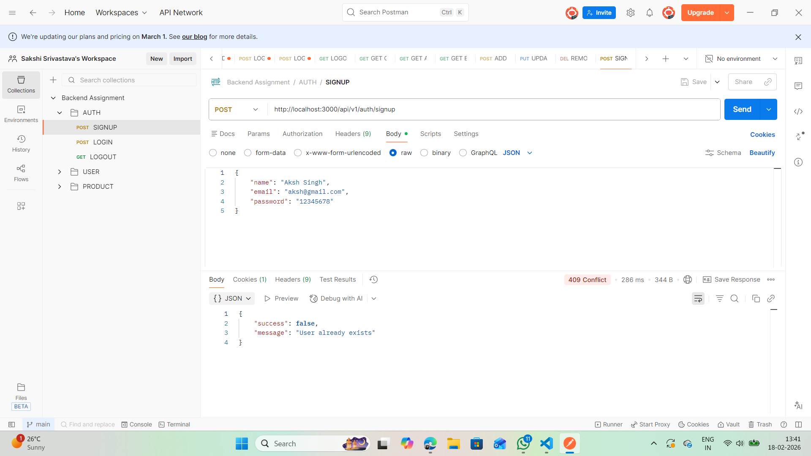
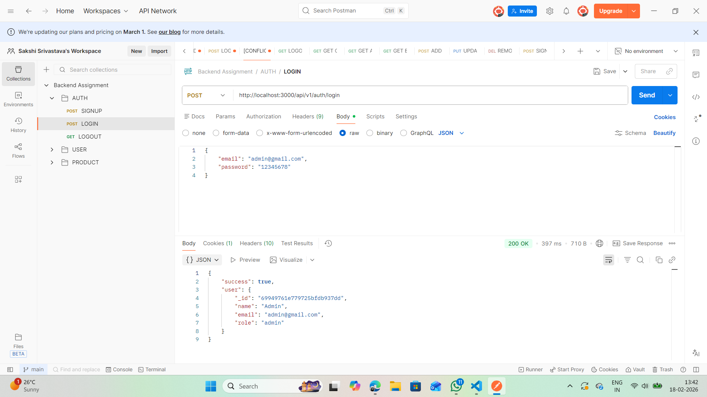
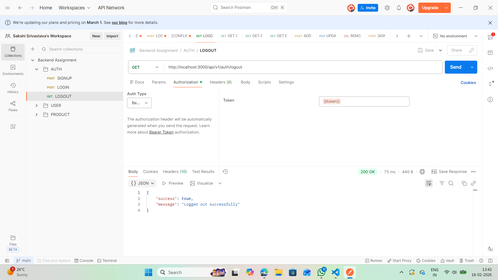
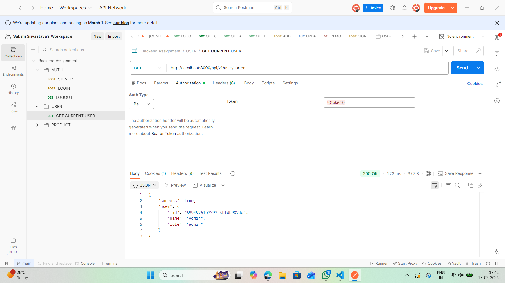
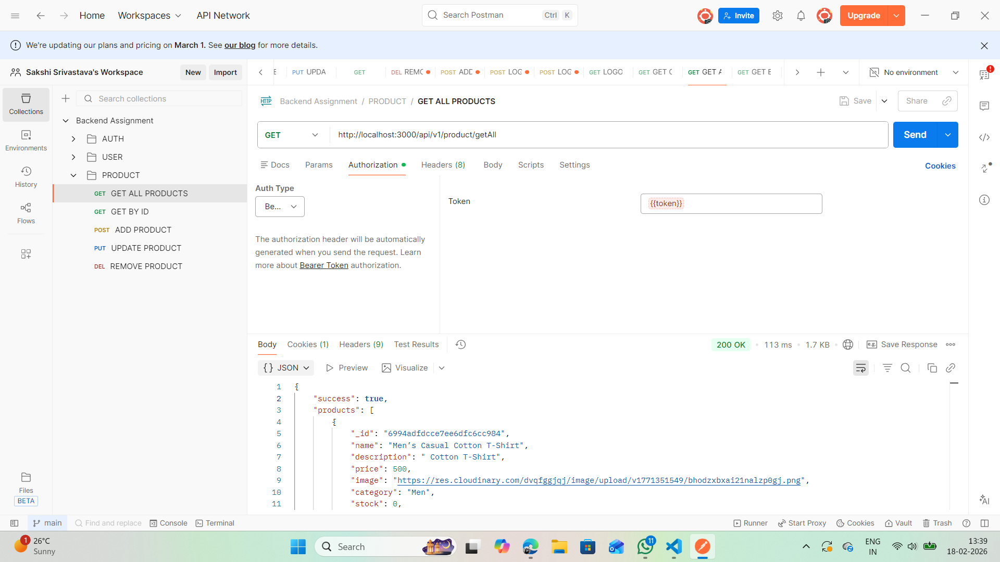
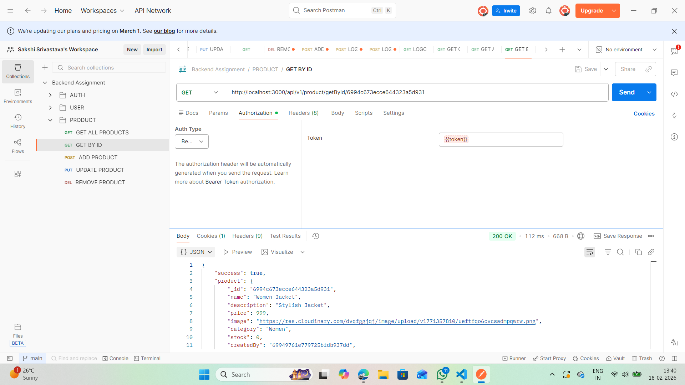
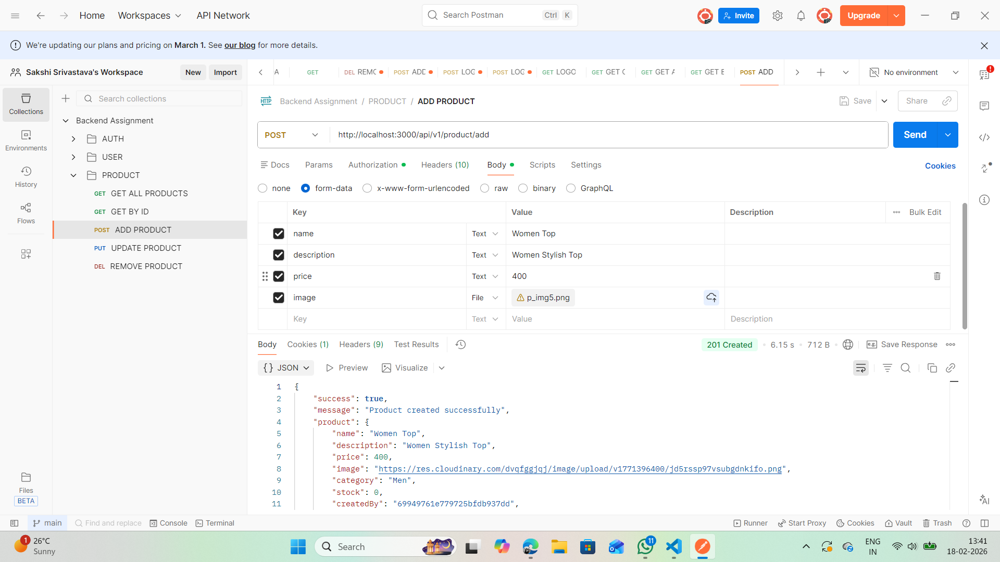
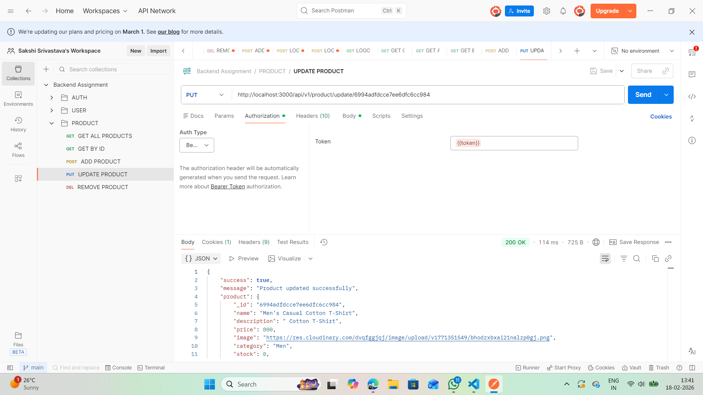
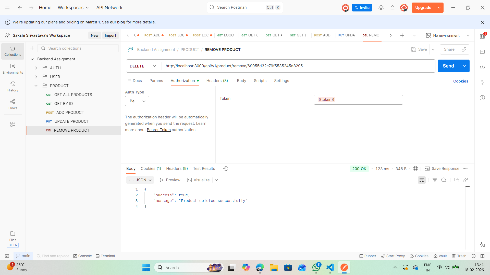

MERN Backend Assignment – Product Management

Project Overview

This project is a backend-focused application built with Node.js, Express, and MongoDB, implementing:

Authentication

Role-based authorization (admin vs user)

CRUD operations for products

The frontend is a minimal React interface used only to test API functionality. The main purpose of this project is to demonstrate backend development skills, including RESTful API design, database management, and secure user authentication.

Features
Backend

User Authentication

Sign up and login functionality

Password hashing with bcrypt

JWT-based authentication

Role-based access control

Product Management

Admin can create, edit, and delete products

Admin and users can fetch products and fetch a product by ID

Supports image uploads using Multer

Data stored in MongoDB

API

Fully RESTful endpoints

Middlewares for authentication and authorization

Input validation and error handling

Frontend (For Testing Only)

Built with React.js

Features:

Register & login users

Access protected dashboard (JWT required)

Perform CRUD operations on products

Display error/success messages

State management with React hooks and Redux

Tech Stack

Backend: Node.js, Express.js

Database: MongoDB (via Mongoose)

Authentication: JWT, bcrypt

File Uploads: Multer

Frontend: React.js (minimal interface)

Testing: Postman

Folder Structure
root
│
├─ backend
│   ├─ controllers      # Business logic for user/product operations
│   ├─ middleware       # Auth, role-based access, error handling
│   ├─ models           # MongoDB schemas (User, Product)
│   ├─ routes           # API endpoints
│   ├─ utils            # Admin creation script
│   └─ index.js         # Express server setup
│
├─ frontend
│   ├─ src/pages        # Components for testing APIs
│   └─ src/redux        # Minimal state management
└─ README.md

API Endpoints
Auth
Method	Endpoint	Description
POST	/api/v1/auth/signup	Register a new user
POST	/api/v1/auth/login	Login user and return JWT
GET	/api/v1/auth/logout	Logout user (protected)
User
Method	Endpoint	Description
GET	/api/v1/user/current	Get current logged-in user (protected)
Products
Method	Endpoint	Description
GET	/api/v1/product/getAll	Get all products
GET	/api/v1/product/getById/:id	Get product by ID
POST	/api/v1/product/add	Add a new product (admin only)
PUT	/api/v1/product/update/:id	Update a product (admin only)
DELETE	/api/v1/product/remove/:id	Delete a product (admin only)

Use Postman or the minimal frontend to test API requests.

Installation & Setup
Backend
git clone <your-repo-link>
cd backend
npm install

Create a .env file:

PORT=3000
MONGO_URI=<your-mongodb-connection-string>
JWT_SECRET=<your-secret-key>
CLOUDINARY_NAME=<your-cloudinary-name>
CLOUDINARY_API_KEY=<your-cloudinary-api-key>
CLOUDINARY_API_SECRET=<your-cloudinary-api-secret>

Start the backend server:

npm run dev

Frontend (Optional Testing)
cd frontend
npm install
npm start

Frontend runs on: http://localhost:5173

Backend runs on: http://localhost:3000

Postman Collection

A Postman collection is included for testing all backend APIs:

Auth: Signup/Login

User: Get logged-in user

Product CRUD operations

You can include screenshots of Postman requests in screenshots/ for clarity.

Future Improvements

Add pagination and filtering for products

Implement unit and integration tests for backend

Add more advanced error handling

Scalability & Architecture Considerations

This application currently follows a monolithic architecture. For production-level traffic, the following improvements can be implemented:

1️⃣ Microservices Architecture

Separate services for Authentication, Products, Image Upload

Enables independent scaling and fault isolation

2️⃣ Caching with Redis

Cache frequently accessed product listings

Reduce DB load and improve response time

3️⃣ Load Balancing

Deploy multiple backend instances behind NGINX or AWS ELB

Distribute traffic evenly and improve availability

4️⃣ Database Optimization

Add indexes on frequently queried fields

Use connection pooling

Implement pagination for large datasets

5️⃣ Containerization & Orchestration

Use Docker for containerization

Kubernetes for auto-scaling, self-healing, and efficient resource utilization

6️⃣ Security & Rate Limiting

Implement rate limiting using express-rate-limit

Use Helmet for secure HTTP headers

Store secrets securely using environment variables

## API Test Screenshots
The following screenshots demonstrate successful execution of all backend APIs:

### Authentication
- **Signup:** 
- **Login:** 
- **Logout:** 

### User
- **Get Current User:** 

### Products
- **Get All Products:** 
- **Get Product by ID:** 
- **Add Product:** 
- **Update Product:** 
- **Remove Product:** 

License

This project is open-source under the MIT License.

